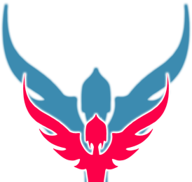

# astral.nvim


[](https://dotfyle.com/plugins/rootiest/astral.nvim)



`astral.nvim` is a Neovim plugin for colorscheme management.

This very simple plugin allows Neovim to remember the last
used colorscheme and restore it when Neovim opens.

## Features

- Remembers the last used colorscheme and restores it when Neovim opens.
- Allows setting fallback themes if the saved colorscheme is not available.

## Installation

Using `lazy.nvim`, add the plugin to your configuration:

```lua
require("lazy").setup({
    {
        "astral/astral.nvim",
        version = "*", -- Pin to GitHub releases
    },
})
```

## Configuration

You can configure the `astral` plugin by passing a table of options to `require("astral").setup()`.

### Default Values

The default values for `astral` configuration are:

```lua
local config = {
    restore_colors = true, -- Enable or disable automatic colorscheme restoration
    fallback_themes = { -- Default fallback themes
        "catppuccin",
        "tokyonight",
        "default"
    },
}
```

### Example Configuration

To set the options for `astral`,
use the following `lazy.nvim` configuration:

```lua
require("lazy").setup({
    {
        "astral/astral.nvim",
        version = "*", -- Pin to GitHub releases
        opts = {
            restore_colors = true, -- Set to false to disable colorscheme restoration
            fallback_themes = { -- Customize fallback themes
                "catppuccin",
                "tokyonight",
                "default"
            },
        }
    },
})
```

## Commands

- **`:Astral reset`**: Reset the colorscheme management.

## Autocommands

- **ColorScheme**: Store the new name when the colorscheme changes.

## Troubleshooting

If you encounter issues with `astral.nvim`, here are some common problems and solutions:

1. **Colorscheme not restoring on startup**:
   - Ensure `restore_colors` is set to `true` in the configuration.
   - Check if the `settings.json` file exists in the `data` path
   (`vim.fn.stdpath("data") .. "/lazy/astral.nvim/settings.json"`).
   If not, the plugin should create it automatically.

2. **Fallback themes not applied**:
   - Verify that the `fallback_themes` array in the configuration contains
   valid colorscheme names.
   - Ensure that the fallback themes are installed and available in Neovim.

3. **Unknown Astral command error**:
   - Ensure you are using valid commands. The available command is `:Astral reset`.

4. **Colorscheme changes not saved**:
   - Ensure there are no errors in the autocommand that triggers
   on the `ColorScheme` event.
   - Check if the `settings.json` file is writable and that your
   Neovim configuration allows writing to this path.

If the issue persists, please open an issue on the
[GitHub repository](https://github.com/rootiest/astral.nvim) with details
about your configuration and the problem you are facing.

## License

`astral.nvim` is licensed under the MIT License. See [LICENSE](LICENSE) for details.

## Contributing

Contributions are welcome!
Please open an issue or submit a pull request to the
[GitHub repository](https://github.com/astral/astral.nvim).
